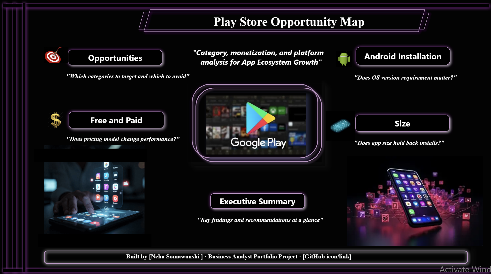

# Play Store Opportunity Map

An interactive Power BI dashboard analyzing the Google Play Store app catalog to answer four real business questions raised by a stakeholder-defined scenario — not a general dataset exploration.



---

## Business Scenario

**Stakeholder:** Priya Menon, VP of App Ecosystem Growth, Google Play

Priya's team advises developers and internal partners on where growth opportunities exist on the Play Store. This project turns the app catalog into a decision-ready dashboard answering her team's four open questions:

1. Which categories should new developers target — and which should they avoid?
2. Does a paid vs. free pricing model change install or rating outcomes?
3. Does app size hold back installs?
4. Does Android version targeting affect installs?

Full requirements are documented in [`BRD_Google_Play_Store_Intelligence.md`](./BRD_Google_Play_Store_Intelligence.md).

---

## Dashboard Structure

| Page | Question Answered |
|---|---|
| **Landing Page** | Navigation hub with project framing |
| **Opportunities** | Which categories are saturated vs. underserved |
| **Free and Paid** | Does pricing model change performance |
| **Size** | Does app size suppress installs |
| **Android Installation** | Does OS version requirement matter |
| **Executive Summary** | Key findings and recommendations at a glance |

---

## Key Findings

- **Entertainment, Video Players, and Social** offer genuine opportunity. Communication ranks high on a naive metric but is outlier-skewed by a handful of dominant incumbent apps.
- **Free and Paid apps perform similarly on rating quality** (gap of ~0.14–0.15). The large install gap reflects catalog composition (92%+ Free) and payment friction — not paid apps being lower quality.
- **App size does not suppress installs.** Using median (robust to blockbuster outliers), Large apps show installs ~100x Small apps.
- **Old Android version targeting correlates with lower installs** (~2.5x lower than Mid/Newer), despite older-version apps not being rare in the catalog — suggesting install performance tracks app currency, not version popularity.

Full write-up with methodology notes and limitations: [`Findings_and_Recommendations_Google_Play_Store.md`](./Findings_and_Recommendations_Google_Play_Store.md).

---

## Methodology Highlights

- **Duplicate-row protection:** all per-app aggregates use `AVERAGEX`/`MEDIANX` over `VALUES(App)` rather than raw column aggregation, to prevent apps appearing in multiple rows from skewing results. App counts use `DISTINCTCOUNT`.
- **Outlier handling:** initial category and size-tier analysis used Average, which was found to be heavily distorted by blockbuster apps (e.g., Communication category, Candy Crush/Subway Surfers in the Large size tier). Median was substituted where this was detected, and both results are documented for transparency.
- **Data cleaning:** `Size` and `Android Ver` fields required custom Power Query logic to parse mixed units (MB/KB) and multi-part version strings (e.g., "4.0.3 and up"), with "Varies with device" rows excluded from size/version-specific analysis only — isolated to a separate query so it did not affect category or pricing analysis.
- **Threshold selection:** Size and Android version tier cutoffs were set using the actual Min/Max/Average of the cleaned data, not arbitrary round numbers.

---

## Tools & Skills Used

Power BI (Power Query, DAX, data modeling) · Excel · Business Requirements Documentation

---

## Repository Structure

```
Dataset/        Raw and cleaned data files
PowerBI/        .pbix dashboard file
Images/         Dashboard screenshots
Docs/           BRD, findings report, this README
```

---

## Limitations

- No geography/country-level data — regional claims (e.g., emerging market device constraints) cannot be tested with this dataset.
- Install counts are approximate ranges (e.g., "10,000+"), not exact figures.
- Analysis reflects a single point-in-time snapshot of the Play Store catalog.

---

## Author

Built by Neha Somawanshi — Business Analyst Portfolio Project
